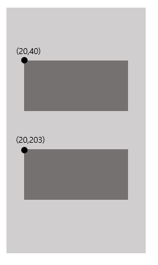

# Autolayout ✏

iOS 개발을 하면서 신경쓸게 한두가지가 아니죠...   
그 중에 골치 아픈것중 하나가 여러 해상도에 따라서 같은 화면을 보여줘야 하는 부분인거 같아요   
아이폰 종류에 따라 스토리보드 혹은 코드를 작성 하면 굉장히 번거러워 지기도 하구요...   
그래서 우리가 사용할 수 있는 기능중 하나가 **오토레이아웃**이에요!   

### Frame Layout 과 Auto Layout
보통 앱은 UI를 뷰의 프레임을 프로그래밍 방식으로 계산합니다. ~~어디까지나 제 생각입니다.~~   
이렇게 되면 프레임의 사이즈를 계산하여 뷰에 배치해야 하는데, 이렇게 되면 복잡해 질 수도 있어요.   
왜 냐면 뷰에대한 크기와 위치를 계산해야하기 때문인데요, 또 수정을 해야하면 영향을 받는 뷰에 다시 프레임을 계산해야 하죠.   
프레임 방식으로 다음과 같은 뷰가 있다고 가정을 해볼게요.   
   
보통 이런식으로 정의를 하여 프로그래밍 방식으로 많이들 하죠!   
계산을 일일히 다 해서 배치를 해야하기때문에 번거러워 질 수도 있습니다.   

그러면 **오토레이아웃을** 쓰면 어떻게 될까요?   
   

이렇게 각각의 **constraint**를 주면 해상도에 맞게 뷰가 나타나게 됩니다.   
일반적으로 봤을 때는 프레임을 하나하나 계산해서 배치하는 것 보다 **Autolayout**의 **constraint**를 주는게 더 편해보이네요   

### 스토리보드에서 사용하기
스토리보드에서 수정을 하려면 하단에 Pin 메뉴와 Align 메뉴를 통하여 수정 할 수 있습니다.   
Pin 메뉴부터 먼저 보시면   
   
이렇게 나옵니다.   
Add New Constraints 쪽에서 Constraints를 설정 할 수 있습니다.   
다음은 Align을 설정 할 수 있는 탭입니다.   
   
view의 Horizontal 위치 와 Vertical 위치를 설정 할 수 있어요!   
Horizontal이 0이고 Vertical이 0이면 뷰의 센터에 위치하게 되요!   
근데 스토리보드에서도 결국엔 고정 값 으로만 지정을 할 수 있어서 어느 정도 한계가 있어요 ㅠㅠ   
그렇게 되면 결국 코드로 AutoLayout을 설정을 해야 할 경우도 있다는건데, 코드로는 어떻게 설정 할까요?


###코드에서 사용하기

  ```
	var acceptButton = UIButton()
    var declineButton = UIButton()
  ```   
  다음과 같이 버튼 두개를 코드로 생성했다고 가정을 해봅시다!   
  
  ```
        acceptButton.setTitle("수락하기", for: .normal)
        acceptButton.setTitleColor(.white, for:.normal)
        acceptButton.backgroundColor = .systemBlue
        acceptButton.titleLabel?.font = UIFont.boldSystemFont(ofSize: 20)
        acceptButton.layer.cornerRadius = 20
    
        self.view.addSubview(acceptButton)
        
        acceptButton.translatesAutoresizingMaskIntoConstraints = false
        acceptButton.leftAnchor.constraint(equalTo: view.leftAnchor, constant: 19)
                .isActive = true //1
        acceptButton.bottomAnchor.constraint(equalTo: view.safeAreaLayoutGuide.bottomAnchor, constant: 0)
                .isActive = true //2
        acceptButton.heightAnchor.constraint(equalToConstant: 50)
                .isActive = true //3
        acceptButton.widthAnchor.constraint(equalToConstant: (view.bounds.width/2 - 30))
                .isActive = true //4
        
        declineButton.setTitle("거절하기", for: .normal)
        declineButton.setTitleColor(.white, for:.normal)
        declineButton.backgroundColor = .systemPink
        declineButton.titleLabel?.font = UIFont.boldSystemFont(ofSize: 20)
        declineButton.layer.cornerRadius = 20
    
        self.view.addSubview(declineButton)
        
        declineButton.translatesAutoresizingMaskIntoConstraints = false
        declineButton.rightAnchor.constraint(equalTo: view.rightAnchor, constant: -19)
                .isActive = true //5
        declineButton.bottomAnchor.constraint(equalTo: view.safeAreaLayoutGuide.bottomAnchor, constant: 0)
                .isActive = true //6
        declineButton.heightAnchor.constraint(equalToConstant: 50)
                .isActive = true //7
        declineButton.widthAnchor.constraint(equalToConstant: (view.bounds.width/2 - 30))
                .isActive = true //8
  ```   
1번은 acceptButton을 superview 의 X 축 기준으로  정렬을 시킵니다.   
필히 isActive = true 를 넣어주셔야 적용이 되요! 아니면 NSLayoutConstraint.active(지정 컨스트레인트)를 통해서도 적용이 가능합니다   
2번은 acceptButton을의 Y축을 정렬시켜 주는 코드입니다. 마찬가지로 superview 기준이구요.   
3번은 acceptButton의 높이를 주는 코드입니다.   
4번은 acceptButton의 넓이를 지정하는 코드 입니다. 저같은 경우는 view.bounds.width 값을 계산하여   
뷰 자체의 2/1로 지정을 하고 거기에 30을 뺀 형태로 지정을 했어요!   
5번은 declineButton의 X 축 기준을 주는 코드 입니다.   
1번 같은 경우에는 acceptButton을 뷰의 leftAnchor 기준으로 주어서 constraint를 적용했지만 declineButton 같은 경우에는   
rightAnchor 기준으로 주어서 constraint를 적용 했어요!   

다음과 같이 코드를 짜면 이런 형태로 나와요!   
   
제가 직접 에뮬레이터로 보여드리고 싶지만... 현재 사정이 에뮬레이터로 보여드리기 어렵네요..ㅠㅠㅠ   
양해 부탁드립니다ㅠㅠㅠ  