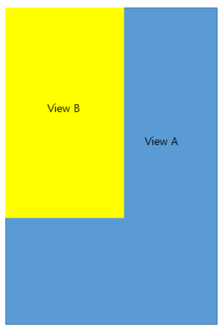

# Bounds vs Frame ✏

* Bounds: 뷰의 위치가 뷰 자신의 좌표계에 의해 결정됩니다.
* Frame: 뷰의 위치가 부모의 뷰에 의해 결정됩니다.

~~다들 똑똑하시니까 이해 했으리라 믿고 글을이만 마치....지 않고 계속 작성 해보겠습니다.~~     

일단 Frame과 Bounds는 UIView의 프로퍼티 입니다.

  ```
	open var frame: CGRect
	open var bounds: CGRect
  ```

CGRect 타입을 사용하고 있는데 origin과 size를 가지고 있다는 뜻 입니다.   
즉 쉽게 생각하면 x,y 좌표 width,height를 가진다고 할 수 있습니다.   

## Frame

일단 frame 의 제일 중요한 부분은 **SuperView(상위뷰)** 입니다.   
**SuperView(상위뷰)의 좌표** 안에서 View의 위치와 크기를 나타냅니다.   

예를 들어 봅시다.(~~그림 그리기 귀찮은데..~~)   

여기 사진에서 View B 는 View A에 종속되어 있는 관계입니다.   
여기서 View B의 x,y 좌표는 0,0입니다. 이 뜻은 View A의 origin 으로 부터 (0,0)이 떨어져 있다는 의미 입니다.   
여기서 SubView의 origin 을 (10,50)으로 준다면 다음과 같이 될 것입니다.
   
x 좌표로 10 Y 좌표로 50을 준 결과 View A(SuperView)의 origin에서 (10,50) 떨어진 곳에 그린다는 뜻 입니다.

## Bounds

Bounds의 핵심 기능은 **독립적인 좌표** 를 가집니다. frame 같은 경우에는 SuperView 의 종속되어 좌표를 가졌지만,   
반대로 Bounds 같은 경우는 **독립적으로 좌표**를 가집니다.   
초기상태로 아래와 같은 뷰가 있다고 가정해 봅시다.   


여기서 다음과 같이 x,y 좌표를 다음과 같이 줘볼게요.

  ```
	viewA.bounds.origin.x = 30
	viewA.bounds.origin.y = 20
  ```

이렇게 되면 다음과 같은 결과가 나와요.   


여기서 좀 의아하게 생각이 들 수도 있는게 viewA 를 옮겼는데 어떻게 view B 가 바뀌냐라고 할 수 있어요.   
하지만 사실은 view B 는 그 상태에 가만히 있고, view A가 x만큼 30 이동하고 y만큼 20 이동한 것 입니다.   
왜냐면 Bounds는 자기 자신의 좌표를 가지기 때문이에요.   


