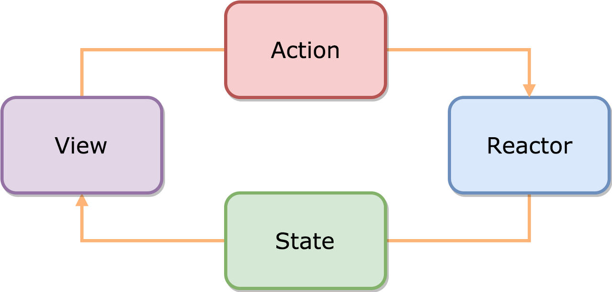

# ReactorKit ✏ 
ReactorKit을 사용해보고 정리를 한번 해보려 합니다.   
우선 ReactorKit에 대한 자세한 설명은 [여기](https://medium.com/styleshare/reactorkit-%EC%8B%9C%EC%9E%91%ED%95%98%EA%B8%B0-c7b52fbb131a) 있습니다.   
저는 제 나름대로 정리를 하여 올린 부분이니 한번만 봐주세요 ㅠㅠ   

## 구조
ReactorKit을 검색해보면 가장 흔하게 보실 수 있는 사진입니다.   
   
여기서 동작하는 부분을 간단하게 정리를 해보자면   
1. View는 사용자 인터렉션을 Reactor에 전달합니다.   
2. Reactor는 Action에 따라서 로직을 수행합니다.   
3. Reactor는 뷰에 상태를 전달합니다.   

여기서 뷰는 비지니스 로직을 수행하지 않습니다.   
반대로 리엑터에서는 뷰의 상태를 가짐과 동시에, 비지니스 로직을 수행합니다.   

 
## View는 어떻게 사용하냐?
앞서 말했듯 View에는 비지니스 로직이 없고, 오직 View만 가지고 있습니다.   
그리고 ReactorKit.View의 프로토콜을 채택하여 사용해야 하는데, 이떄 필수적인 부분이 친구들이 있습니다.   
바로```DisposeBag```과 ```bind(reactor:)``` 메서드를 필수로 사용해야 합니다.   
코드로 한번 보시죠!   
```
class MainViewController: UIViewController,ReactorKit.View {
 
    var disposeBag = DisposeBag()

    override func viewDidLoad() {
      super.viewDidLoad()
    }
    
    func bind(reactor: MainReactor) {
    }
}
```   
이런식으로 disposeBag과 bind 함수를 사용해줘야 해요.   
여기서 원하는 뷰를 코드로 그려도 되고, 스토리보드를 이용하시는 분들은 스토리보드의 뷰를 여기에 연결을 해서 사용하시면 됩니다.    

그럼 어떻게 사용하냐?   
```
	
	func bind(reactor:TestReactor){
	
	//사용자가 Action을 할 경우
		self.myButton.rx.tap
			.map{Reactor.action.increase}
			.bind(to:reactor.action)
			.disposed(by:disposeBag)
			
	//Reactor의 State값을 bind 할 경우
		reactor.state.map{$0.data}
			.bind(to: mLabel.rx.text)
			.disposed(by:disposeBag)
	}
	
```   
요롷게 사용을 하시면 됩니다.   
## ReactorKit의 세부적인 구조
ReactorKit을 자세히 들여다 보면 밑에 사진과 같은 구조로 되어있어요.   
   
여기서 Reactor에서 ACtion이 있으면 ```mutate()``` 와 ```reduce()```를 거쳐 State가 변경이 됩니다.   
그럼 이 두 함수는 어떤역활을 하냐   
1. mutate   
 * Action을 Mutation으로 변환을 시켜줍니다.   
 * Observable로 Mutation을 return 시켜 줍니다.   
 * 보통 네트워크, 비동기 비지니스 로직이 여기에 사용됩니다.=> 이 값이 reduce로 전달됨.   
2. reduce
 * Mutation을 받아 바뀐 State 값을 return 시켜 줍니다.   

## ReactorKit을 어떻게 사용하냐?
일단 사용할 ReactorKit을 사용할 클래스들은 Reactor의 프로토콜을 채택하여 사용합니다.   
기본 구조는 다음과 같아요   
```
import ReactorKit
import RxSwift

class TestReactor: Reactor {
   
    let initialState: State = State()
    
    enum Action {
        case increase
    }
    
    enum Mutation {
        case increaseValue
    }
    
    struct State {
        var data:Int = 0
    }
    
    
    func mutate(action: Action) -> Observable<Mutation> {
    }
      
    func reduce(state: State, mutation: Mutation) -> State {
    }
    
}
```   

아까 View단에서 Action으로는 increase를 bind하고 State 값으로는 data를 바인드 했었죠?   
여기에서 Action에 increase의 경우를 만들고, State에는 data라는 프로퍼티가 있습니다.   
TestReactor 클래스 안에 있는 프로퍼티들을 바인딩 한거라고 생각하시면 쉬울듯 합니다 ㅎㅎ   

그러면 여기서 버튼을 눌렀을 때 어떻게 동작을 해야할지 코드를 작성 해보겠습니다.   

```
	// enum Action 에서 increase일 경우 increaseValue의 Mutation을 반환
    func mutate(action: Action) -> Observable<Mutation> {
		switch action{
		case .increase:
			return Observable.just(Mutation.increaseValue)
		}
    }
     
	//enum Mutation에서 increaseValue일 경우 현재 state 값을 가져와 newState에 넣어준뒤 State의 data값에 1을 더한뒤 반환
    func reduce(state: State, mutation: Mutation) -> State {
		var newState = state
		switch mutation{
		case .increaseValue:
			newState.data += 1
		}
		return newState
    }
```   

mutate 메서드에서는 액션타입을 받아 수행해야할 mutation을 반환 하고   
reduce 메서드에서는 mutation타입을 받아 로직을 처리한 뒤 그 결과값을 state로 반환 합니다.   

